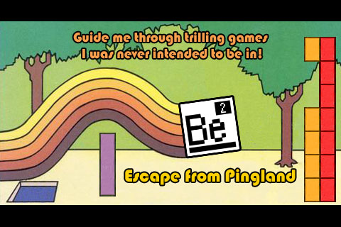
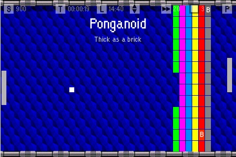
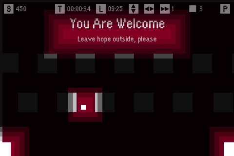

Be2 - Escape from Pingland
==========================

This is the source code for my iOS game "Be2 - Escape from Pingland", including the level editor Pythin/QT application. 

It was featured in the "News & Noteworthy" section of the US App Store and many others.

Click the image below to watch the trilling trailer! :-)

There is even an "user guide" video with all the levels inthe game!

Do whatever you want with it. Just say ["Hi!" to me at alessandro.iob@gmail.com](mailto:alessandro.iob@gmail.com) if you find it interesting!

It is an old game, but you can find code for:

* Lua scripting integration.
* In-App purchase management.
* Remote managemente console.
* Python/PyQT based level editor with live level upload.
* Pong paddle AI and maybe solve the mistery of Be2 ;-)

Compile the application
-----------------------

Just open the project and compile. I have tested it with XCode 4.6.1 and it works. Many warnings, but it works.

Run the editor
--------------

The editor is written in Python and PyQT. To use it you first have to install:

* [Qt libraries 4.8.4 for Mac](http://releases.qt-project.org/qt4/source/qt-mac-opensource-4.8.4.dmg)
* qmake
* [QScintilla](http://www.riverbankcomputing.com/software/qscintilla/download)
* [sip](http://www.riverbankcomputing.com/software/sip/download)
* [PyQT4](http://www.riverbankcomputing.com/software/pyqt/download)

Follow the install instructions for the relative packages. Usually:

QScintilla:

	cd Qt4Qt5
    qmake qscintilla.pro
    make
    make install
	
sip:

	python configure.py
	make
	make install
	
PyQT4:

	python configure.py
	make
	make install

After that you can start the editor from the command line:

	cd Be2/Utilities
	python levelEditor/LevelEditor.py
	
Load a level definitions from the "Levels" directory. Have fun!

Notes
-----

I have removed OpenFeint support from the project but you can find the code in the **'Classes'** folder. 
There you can find also the In-App purchase code.

Legal Stuff
-----------

"Be2 - Escape from Pingland" copyright 2010-2011 Alessandro Iob.
All trademarks and copyrights reserved.

The source code contained within the **'Classes'** and **'Utilities'** folder remains
copyrighted and licensed by Alessandro Iob under the original terms.
The images contained within the **'Resources'** and **'ResourcesApp'** folder remains
copyrighted and licensed by Alessandro Iob under the original terms.
You cannot redistribute or sell my source code from the original
game. You can use my source code for personal entertainment or
education purposes.

Please note that this is being released without any kind of support
from Alessandro Iob. I cannot help in getting this running
and I do not guarantee that you will be able to get it to work, nor
do I guarantee that it won't blow up your computer and/or iOS device
if you do try and use it. Use at your own risk.

Bla bla bla!

Just do not change some graphics, compile and distribute the game as it was yours.
Otherwise do whatever you like!
